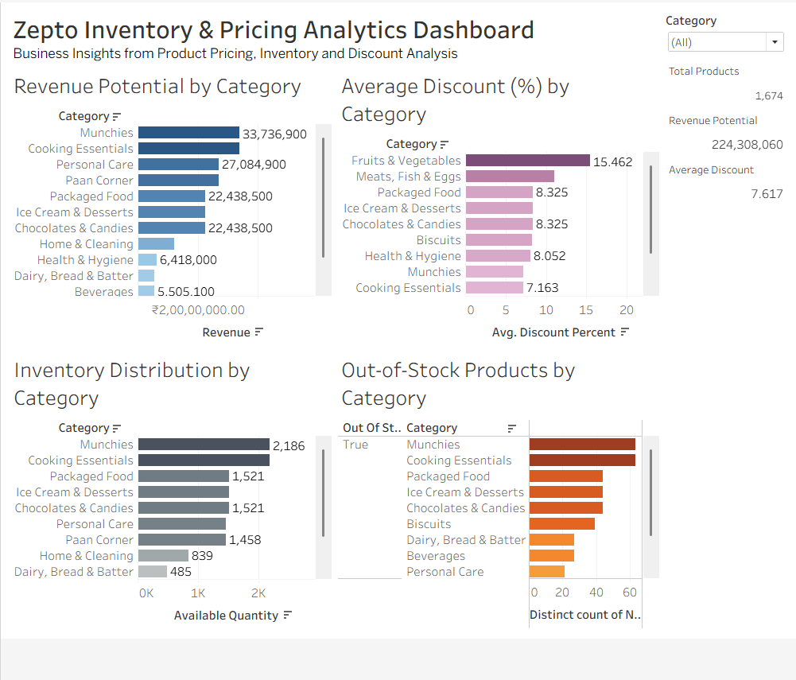

# 🛒 Zepto Inventory & Pricing Analysis using SQL

## Project Overview

This project analyzes Zepto's product inventory dataset using PostgreSQL to derive insights related to inventory management, pricing strategies, discount effectiveness, and revenue opportunities.

The analysis simulates real-world retail analytics use cases and demonstrates the application of SQL for business decision-making.

---

## Business Objective

Quick-commerce platforms such as Zepto manage thousands of products across multiple categories while balancing inventory availability, pricing competitiveness, and profitability. Poor inventory planning can lead to stock-outs and lost sales, while ineffective discounting strategies can negatively impact margins.

This project leverages SQL to analyze Zepto's product inventory and pricing data with the objective of:

- Identifying high revenue-potential products and categories
- Evaluating discount effectiveness across categories
- Detecting premium products that are currently out of stock
- Assessing inventory distribution and stock availability
- Identifying products that offer the best value to customers

The insights generated can support data-driven decisions related to inventory management, pricing strategy, and revenue optimization.

---

## Dataset Information

- Source: Kaggle
- Total Products: 3,700+
- Categories: 14+
- Attributes:
  - Product Name
  - Category
  - MRP
  - Discount %
  - Selling Price
  - Available Quantity
  - Product Weight
  - Stock Availability

---

## Tools Used

- PostgreSQL
- SQL
- GitHub

---

## Data Cleaning

The following cleaning steps were performed:

- Removed records with invalid pricing
- Converted prices from paise to rupees
- Verified inventory and stock availability fields

---

## Analysis Performed

### 1. Top Discounted Products
Identified products offering the highest discounts.

### 2. High-Value Products Out of Stock
Detected premium products unavailable for purchase.

### 3. Revenue Potential by Category
Estimated revenue using:

Revenue = Selling Price × Available Quantity

### 4. Premium Products with Low Discounts
Analyzed pricing strategies for high-value products.

### 5. Average Discount by Category
Compared discounting behavior across categories.

### 6. Best Value Products
Calculated price-per-gram metrics.

### 7. Inventory Segmentation
Classified products into inventory tiers using SQL window functions.

### 8. Category-wise Inventory Weight
Measured inventory concentration across product categories.

---
## Dashboard

The Tableau dashboard provides a visual overview of:

* Revenue Potential by Category
* Average Discount by Category
* Inventory Distribution by Category
* Out-of-Stock Products by Category



### Interactive Dashboard

Explore the live interactive dashboard on Tableau Public:

**🔗 Tableau Public Dashboard:**
https://public.tableau.com/views/SQL_Zepto_Project/Dashboard1?:language=en-GB&:sid=&:redirect=auth&:display_count=n&:origin=viz_share_link

### Dashboard Highlights

* Identified categories with the highest revenue potential based on inventory availability and discounted selling prices.
* Compared average discount percentages across categories to evaluate pricing strategies.
* Analyzed inventory distribution to identify categories with high stock concentration.
* Highlighted categories with the highest number of out-of-stock products, indicating potential revenue leakage.
* Enabled interactive category-level filtering for deeper business analysis.

---

## Key Insights

- High-value products were found to be out of stock, indicating potential revenue loss.
- Certain categories relied heavily on discount-driven sales.
- Revenue potential was concentrated among a few categories.
- Significant differences were observed in product value when comparing price-per-gram.
- Inventory distribution varied considerably across categories.

---

## SQL Concepts Demonstrated

- Data Cleaning
- Aggregate Functions
- GROUP BY
- ORDER BY
- CASE Statements
- Window Functions
- Revenue Calculations
- Business KPI Analysis

---

## Repository Structure

```text
├── data
│   └── zepto_v2_UTF.csv

├── sql
│   └── zepto_inventory_analysis.sql

├── screenshots

└── README.md
```

---

## Future Improvements

- Build an interactive Tableau dashboard
- Create Power BI visualizations
- Develop inventory forecasting models
- Add demand prediction capabilities

---

## Author

Abhishek Bhuniya

Business Analyst | Research Analyst | Aspiring Consultant
